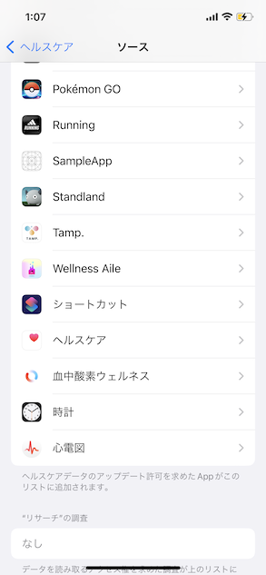
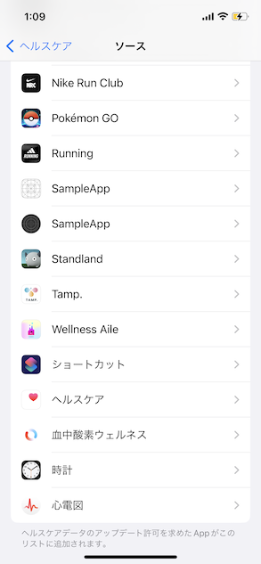

# Single target WatchOS app project within healthkit access

Apple Developer forums

https://developer.apple.com/forums/thread/715238

## Issue

The Watch App and iPhone App health care permissions are not synchronized.

I developed an iPhone/Watch app with the single target setting (new method) for Watch app projects, which will be available from Xcode14.
This app uses HealthKit to retrieve information such as step count and heart rate from healthcare.
The watch app is not independent and requires the iPhone app (companion app).
Regarding the permission to access health care, i found some differences from the Old WatchApp Project (application project structure using WatchExtension when Xcode 13.4 or lower is used).

- This does not occur in the iPhone simulator or watch simulator, but only on the actual device.

- Both the iPhone app and watch app now display a dialog to allow access to health care
  - In  the Old WatchApp Project, if access was granted in either app, the granted access is synchronized.
- When checking the Health Care access status in the iPhone Settings App, permission settings for both the iPhone app and watch app are displayed independently.
  - Because each permission setting is independent, you can choose to allow access to the iPhone app but not to allow it to the watch app.
  - In the old method, permission settings for the iPhone app and watch app were synchronized, so it was not possible to have different settings for each.

## Reproduction Method

1. Build App - SingleTargetApp+WatchExtension
   1. This app is the Old WatchApp Project
   2. Modify bundle Identifier and other settings as needed
2. Make sure that you have permission to access health care on either the iPhone app or the watch app, and that permission settings are synchronized on each.
3. Next Build App - SingleTargetWatchApp
   1. This app is the Newest Watch App Project
   2. Modify bundle Identifier and other settings as needed
4. You can verify that your health care settings are not synced between the iPhone app and the Watch app

Figure 1.
SingleTargetApp+WatchExtension App's (as SampleApp) HealthCare Authorization Settings.
Only one SampleApp item is shown.

Figure 2.  
SingleTargetApp App's (as SampleApp) HealthCare Authorization Settings.
Two SampleApp items are shown.

